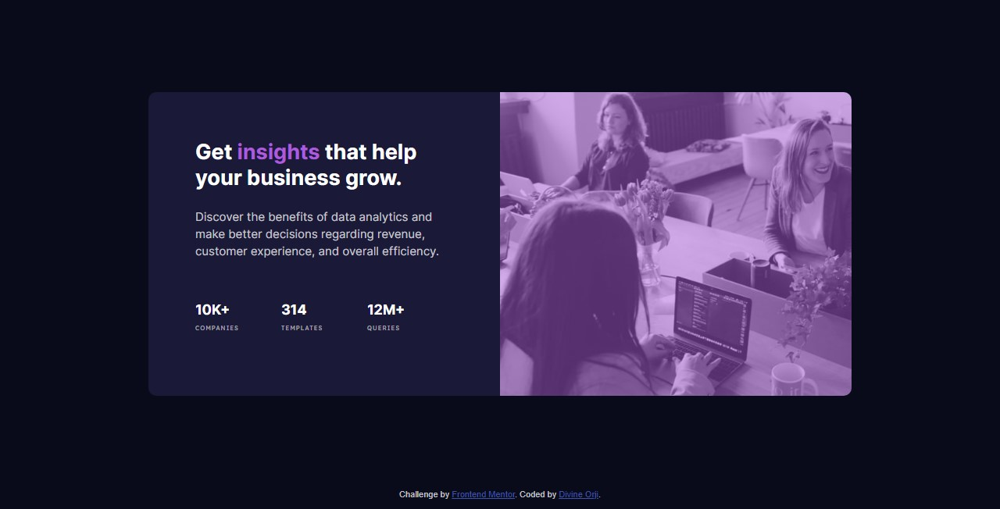

# Frontend Mentor - Stats preview card component solution

This is a solution to the [Stats preview card component challenge on Frontend Mentor](https://www.frontendmentor.io/challenges/stats-preview-card-component-8JqbgoU62). Frontend Mentor challenges help you improve your coding skills by building realistic projects.

## Table of contents

- [Frontend Mentor - Stats preview card component solution](#frontend-mentor---stats-preview-card-component-solution)
  - [Table of contents](#table-of-contents)
  - [Overview](#overview)
    - [The challenge](#the-challenge)
    - [Screenshot](#screenshot)
    - [Links](#links)
  - [My process](#my-process)
    - [Built with](#built-with)
    - [What I learned](#what-i-learned)
    - [Continued development](#continued-development)
    - [Useful resources](#useful-resources)
  - [Author](#author)
  - [Acknowledgments](#acknowledgments)

## Overview

### The challenge

Users should be able to:

- View the optimal layout depending on their device's screen size

### Screenshot



### Links

- Solution URL: [Add solution URL here](https://your-solution-url.com)
- Live Site URL: [Add live site URL here](https://your-live-site-url.com)

## My process

### Built with

- Semantic HTML5 markup
- CSS custom properties
- CSS Grid
- Mobile-first workflow

### What I learned

I learned how to create color variables to be used throughout the project

```css
:root {
  --bg-main: hsl(233, 47%, 7%);
  --bg-card: hsl(244, 38%, 16%);
  --accent: hsl(277, 64%, 61%);
  --accent-transparent: hsla(277, 64%, 61%, 0.5);
  --h-main: hsl(0, 0%, 100%);
  --h-stat: hsla(0, 0%, 100%, 0.6);
  --p-main: hsla(0, 0%, 100%, 0.75);
  font-size: 15px;
}
```

I learned how to overlay colors on background images

```css
.image-box {
  min-height: 15rem;
  background: linear-gradient(
      0deg,
      var(--accent-transparent),
      var(--accent-transparent)
    ), url(./images/image-header-mobile.jpg);
  background-size: cover;
  background-repeat: no-repeat;
  border-radius: 10px 10px 0 0;
}
```

I also solidified my knowledge of CSS Grid a whole lot more.

### Continued development

I would work on speedily building websites using the mobile-first approach, and strengthening my CSS skills so I can be able to do more with CSS. I would also build my knowledge of semantic HTML so I don't have to use the `<div>` tag all the time.

### Useful resources

- [A Complete Guide to Grid - CSS Tricks](https://css-tricks.com/snippets/css/complete-guide-grid/) - This helped me understand CSS Grid properly and be able to apply it in this project. I would highly recommend it.
- [StackOverflow Answer](https://stackoverflow.com/questions/36679649/how-to-add-a-color-overlay-to-a-background-image/36679903) - The solution to this stackoverflow question worked well for me in learning how to overlay background images with color.

## Author

- Website - [Divine Orji](https://dpkreativ.vercel.app)
- Frontend Mentor - [@dpkreativ](https://www.frontendmentor.io/profile/dpkreativ)
- Twitter - [@dpkreativ](https://www.twitter.com/dpkreativ)

## Acknowledgments

Thank you Matt, the frontendmentor team, and the community for creating this platform to help me build my skills. God bless you all.
